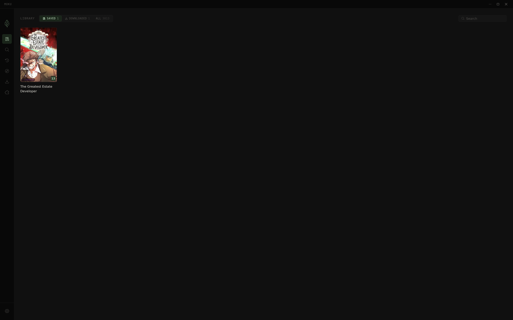
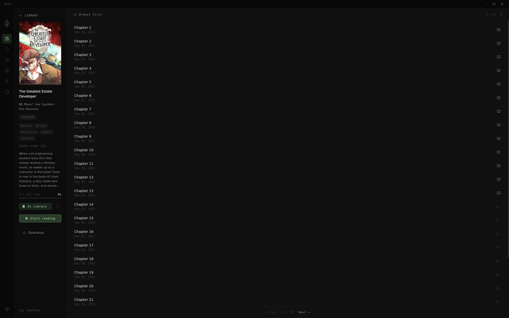
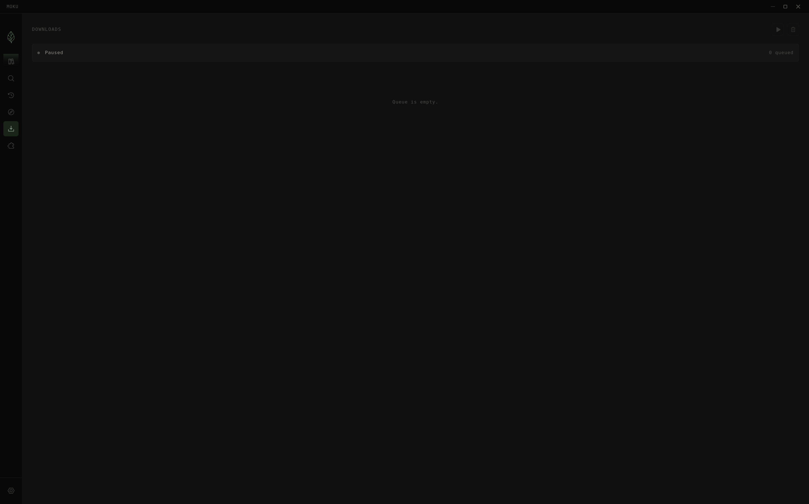
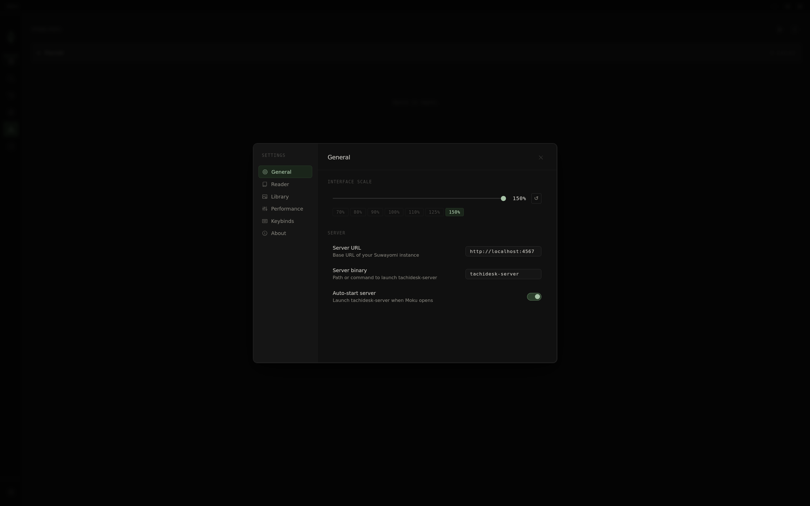

<div align="center">
  
  <h1>Moku</h1>
  <p>A fast, minimal manga reader frontend for <a href="https://github.com/Suwayomi/Suwayomi-Server">Suwayomi-Server</a>, built with Tauri and React.</p>

  <table>
    <tr>
      <td></td>
      <td></td>
      <td></td>
    </tr>
    <tr>
      <td></td>
      <td></td>
      <td></td>
    </tr>
  </table>
</div>

---

## Features

- Library management with cover art browsing
- Full manga reader with keyboard navigation
- Chapter download queue
- Extension and source management
- Source migration with read progress transfer
- Cross-source search
- Reading history tracking

## Requirements

[Suwayomi-Server](https://github.com/Suwayomi/Suwayomi-Server) must be running at `http://127.0.0.1:4567`.
 > Note: The application does also launch the server on start-up by itself, so only the package is required on path.

## Installation

**Nix (recommended)**

```bash
nix run github:Youwes09/moku
```

Or add to your flake:

```nix
inputs.moku.url = "github:Youwes09/moku";
```

**From source**

```bash
git clone https://github.com/Youwes09/moku
cd moku
nix build
./result/bin/moku
```

## Development

```bash
nix develop
pnpm install
pnpm tauri:dev
```

> `tauri:dev` uses `src-tauri/tauri.dev.conf.json` to set the Vite dev server URL, keeping the release build config clean for `nix build`.

## Stack

| | |
|---|---|
| [Tauri v2](https://tauri.app) | App shell |
| [React](https://react.dev) + [TypeScript](https://www.typescriptlang.org) | UI |
| [Vite](https://vitejs.dev) | Frontend build |
| [Zustand](https://zustand-demo.pmnd.rs) | State management |
| [Crane](https://github.com/ipetkov/crane) | Nix Rust builds |

## License

Distributed under the [Apache 2.0 License](./LICENSE).

---

## Disclaimer

Moku does not host any content. The developer(s) of this application have no affiliation with the content providers available freely on the internet.
